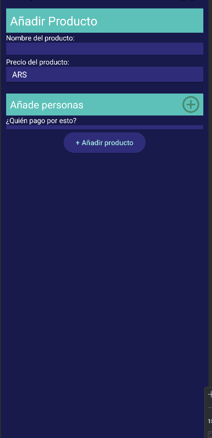

## Descripción

**GastAR** es una aplicación para calcular y dividir los gastos de una salida en grupo. La aplicación permite a los usuarios ingresar los gastos y automáticamente divide el total entre los participantes, facilitando la gestión de los pagos.

## Tecnologías Utilizadas

- **Android Studio**: Desarrollo de la aplicación.
- **Fragments**: Representación de la vista para cada módulo.
- **Miro**: Definición de los diseños.
- **Google Spreadsheets**: Definición de tareas y responsabilidades.

## Acuerdos DoD y DoR

- **DoR (Definition of Ready)**:

  - Diseñar el wireframe.
  - Refinar y asignar la tarea.
- **DoD (Definition of Done)**:

  - Completar la implementación de la tarea.
  - Realizar pruebas unitarias y de integración.
  - Revisar el código (code review).
  - Mergear desde ramas `feat/`, `fix/`, `refactor/` siguiendo conventional commits.
  - Una vez mergeado a `master`, se cierra la tarea.

## Integrantes

- **Emanuel Cifuentes**
- **Cristian Del Canto**

## Arquitectura del Proyecto

```
person
 ├── entity (package)
 ├── exception (package)
 ├── service (package)
 ├── ui (package)
 └── PersonController (class)
product
 ├── entity (package)
 ├── exception (package)
 ├── service (package)
 ├── ui (package)
 └── ProductController (class)
MainActivity
```

## Compilación y Ejecución

### Compilar a APK

1. Abre el proyecto en Android Studio.
2. Ve a `Build` en la barra de menú.
3. Selecciona `Build Bundle(s) / APK(s)`.
4. Selecciona `Build APK(s)`.
5. Una vez completado, encontrarás el APK en el directorio `app/build/outputs/apk/`.

### Ejecutar en Android Studio

1. Conecta un dispositivo Android o inicia un emulador.
2. Haz clic en el botón `Run` (ícono de play) en la barra de herramientas de Android Studio.
3. Selecciona el dispositivo/emulador donde deseas ejecutar la aplicación.
4. La aplicación se instalará y ejecutará en el dispositivo seleccionado.

### Compilar a APK con línea de comando

```sh
./gradlew assembleDebug
```

De esta forma, se creará un APK con el nombre `module_name-debug.apk` en el directorio `project_name/module_name/build/outputs/apk/.`

Mas información en [Android Developers](https://developer.android.com/build/building-cmdline?hl=es-419#kts)
## Enlaces Útiles

- [Android Studio Developers](https://developer.android.com/develop?hl=es-419)
- [Conventional commits](https://www.conventionalcommits.org)
- [Miro](https://miro.com/welcomeonboard/c3A2RFJhUHo1VGhyTEUwM3haMkQ0a2t3Z0YyZlo4ZEk4dkZaclJ3eHJaNUVmNFRvclFabGlmWGM4Z3h1OUdreXwzNDU4NzY0NTk5MjQ3NTIzNDk2fDI=?share_link_id=810501956700)
- [Google Spreadsheets](https://docs.google.com/spreadsheets/d/14udeTr_xGs5dVpWFQtsAp8GKPMyJWPqZSNJykFJ9eX0/edit?usp=sharing)

## Imágenes y capturas de la aplicación
### Vista principal

### Agregar producto


## Funcionalidades Principales

- **Ingreso de Gastos**: Permite a los usuarios ingresar los detalles de los gastos.
- **División Automática**: Calcula y divide automáticamente los gastos entre los participantes.
- **Historial de Gastos**: Guarda un registro de todas las salidas y gastos realizados.

## Requisitos del Sistema

- **Sistema Operativo**: Android 5.0 (Lollipop) o superior.
- **Espacio de Almacenamiento**: Al menos 50 MB de espacio libre.
- **Conexión a Internet**: Requerida para sincronización y actualizaciones.
